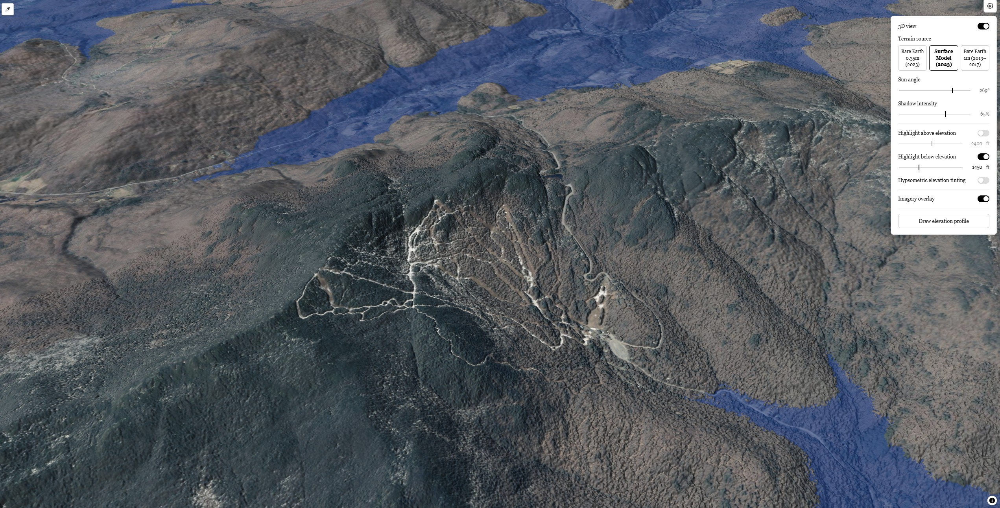

# Vermont Terrain


[](LICENSE)

An interactive terrain map of Vermont, built with [MapLibre GL JS](https://maplibre.org/maplibre-gl-js/docs/) and Svelte 5.



## Features

- Hillshade relief with adjustable sun angle and shadow intensity
- 3D terrain view
- Elevation highlighting above and/or below a chosen threshold
- Hypsometric (elevation-banded) color tinting
- Switch terrain source between bare-earth DEM, a surface model (DSM) that includes buildings and tree canopy, and Mapterhorn's global 1m DEM (2013–2017)
- VCGI aerial imagery overlay
- Click-to-draw elevation profile between two points, charted by distance

## Development

```bash
npm install
npm run dev
```

Then open the printed local URL (defaults to `http://localhost:5173`).

```bash
npm run build     # production build to dist/
npm run preview   # serve the production build locally
```

## Deployment

`npm run build` produces a static site in `dist/` — upload it as-is to any static host (e.g. Azure Blob static website hosting). No server or rewrite rules needed. See [CLAUDE.md](CLAUDE.md) for the build-time gotchas this depends on (relative asset paths, maplibre-gl's worker script).

## Data sources

- VCGI bare-earth DEM and DSM terrain tiles (sourced from USGS elevation data) are pmtiles served from S3, encoded as terrarium raster-dem — the statewide 35cm bare-earth DEM is `STATEWIDE_2023_35cm_DEMHF_TERRARIUM.pmtiles` (244.02 GB):

  ```
  https://s3.us-east-2.amazonaws.com/vtopendata-prd/Elevation/STATEWIDE_2023_35cm_DEMHF_TERRARIUM.pmtiles
  ```
- [Mapterhorn](https://mapterhorn.com/attribution)'s global 1m DEM (2013–2017), loaded from its TileJSON endpoint
- Imagery overlay is VCGI's `IMG_VCGI_CLR_WM_CACHE` ArcGIS tile service

See [CLAUDE.md](CLAUDE.md) for architecture notes.

### What is Terrarium-encoded DEM?

The bare-earth DEM and DSM elevation tiles in this project use **Terrarium encoding** — a standard format that packs 3D elevation data into normal 24-bit RGB raster image tiles inside PMTiles containers.

Instead of representing visual colors, each pixel's Red ($r$), Green ($g$), and Blue ($b$) channel values store precise height data in meters.

#### Elevation decoding formula

MapLibre GL JS decodes real-world elevation ($E$) in meters directly on the GPU using the standard Terrarium equation:

$$E = \left(r \times 256 + g + \frac{b}{256}\right) - 32768$$

- $r, g, b$: the pixel's Red, Green, and Blue color channel values (0–255)
- $-32768$: an offset that allows encoding elevations from below sea level up to +32,767 meters
- **Precision**: storing values across three 8-bit channels provides sub-meter vertical precision ($\frac{1}{256}\text{ m} \approx 3.9\text{ mm}$)

#### Why use Terrarium tiles?

- **Real-time GPU rendering**: WebGL shaders process the RGB tiles on the fly to compute custom hillshading, 3D elevation meshes, hypsometric tinting, and on-demand elevation profile queries
- **Efficient web hosting**: packaging elevation data into compressed image tile pyramids allows statewide high-resolution (35 cm) terrain to be served fast and cheaply over HTTP and cloud storage

## Credits

- [VCGI](https://vcgi.vermont.gov/) — Vermont terrain and imagery data
- [USGS](https://www.usgs.gov/) — elevation data
- [Mapterhorn](https://mapterhorn.com/attribution) — global 1m DEM
- [MapLibre GL JS](https://maplibre.org/) — map rendering
- Cloud storage and egress for the statewide terrain PMTiles are generously provided by AWS.

## AI Disclosure

This application was developed with the assistance of generative artificial intelligence (Anthropic Claude). The content has been reviewed and verified to be accurate.

## License

MIT — see [LICENSE](LICENSE).
